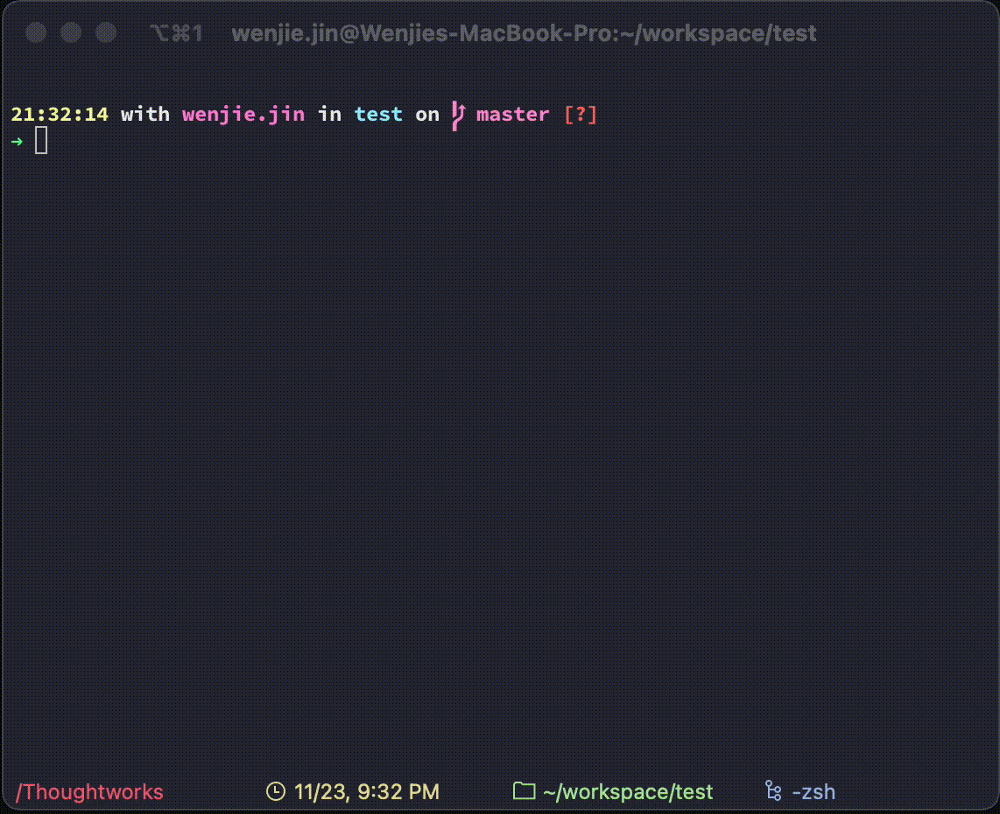

# git-commit-cli

## About

This is a git commit cli enforce the git user to write better git commit messages easily.

## Requirements

- macOS

The shells only tests in macOS terminal, may need some changes on other platforms

## Install

```
bash -c "$(curl -sS https://raw.githubusercontent.com/wwwenjie/git-commit-cli/main/install.sh)"
```

## Usage



- `commit` -> add **all** files to git stage and commit

- `commit --clean` -> clean commit history

- `commit --config` -> set commit message username

- `commit --update` -> update git-commit-cli

- `commit --uninstall` -> uninstall git-commit-cli

## Contribute

Any contribution is welcome!